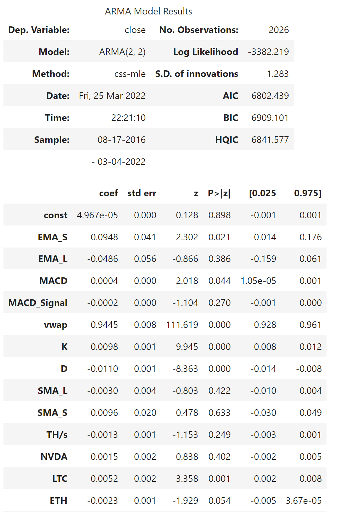
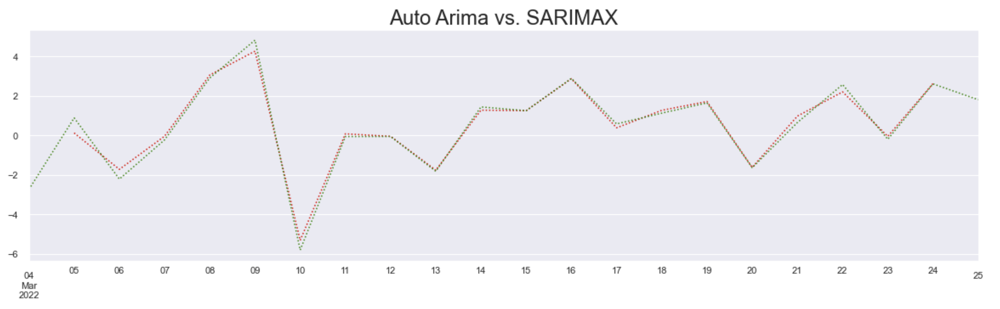
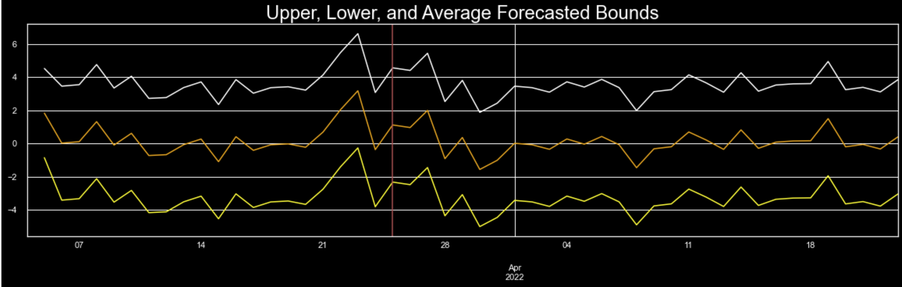
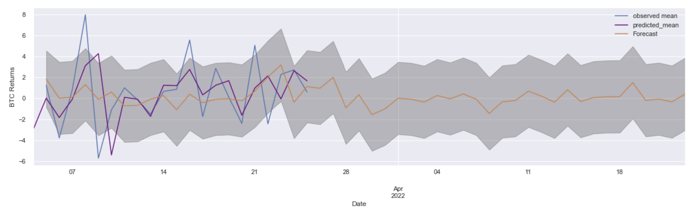
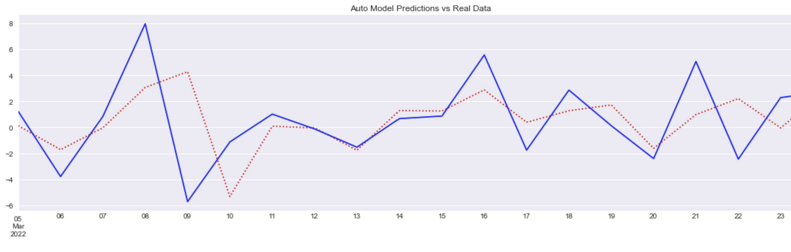
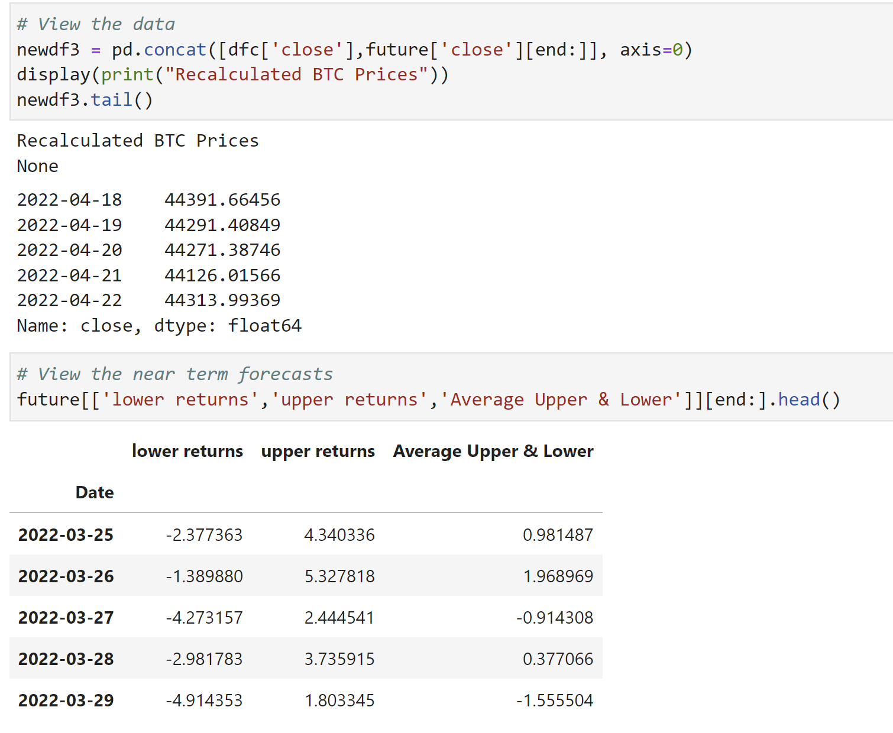

# PROJECT_2

## Pre-Requisites

* An Alpaca Markets API key should be used with an .env file. However a .env file is not required if you do not know how to configure one.  If unknown how to setup an .env file, fret not, you can also leverage the libraries (pip install getpass), and a prompt in the notebook will ask you for your keys. All you will need to do is copy and paste your Alpaca API key and secret key into the text input boxes when prompted. It should be safe from viewing when pasted in the notebook as well.

## Background
Is it possible to model returns of crypto using technical indicators in which we can use optimize parameters using a brute force technique, and apply an Auto Regressive Integrated Moving Average model to appropriately forecast near term returns

Utilizing the following as exogenous factors (x factors/features):
* Bitcoin hash rate data
* NVDA (Nvidia stock price)
* LTC (Litecoin price)
* ETC (Ethereum price)
* Stochastics Oscillator parameters
* MACD parameters
* SMA parameters

## Model Review

We first ran an ARMAX model in which we can empirically test different p,d,q orders. This can also illustrate run time differences between using this empirical process of one by one selecting a model vs. using the Auto-ARIMA library to do this model selection process for us.

The first illustration provides the model summary in which we can use specific criterion to determine a models best fit. In general we will follow these rules:
* The lower the AIC, BIC, HQIC across models the better
* The higher the Log-likehood the better

In the ARMA(2,2) model, the AIC is 6802.439 and the Log Likelihood is -3382.219.
in the SARIMAX(3,0,2) X (1,0,0,5) auto-arima model, the AIC is 7037.665 and the Log likelihood is -3498.833.

The element of seasonality may best explain the better fit chosen by the SARIMAX model

The below illustrates that it may be possible to get the best model by testing one by one quicker than an auto arima model by testing parameters individually.
The illustrations shows the SARIMAX vs Auto-ARIMA model forecasts, which are near identical.

  

## Conclusion
The below illustration contains our forecasted data and values.

The current price of bitcoin is 43,882.90 USD as of 3/24/2022 4:39 PM EST. The model predicts backing into prices from forecasted average log returns that on 4/22/2022 the price of bitcoin will be 44313.99 USD. Representing ~ 0.98% upside.

Near term we probably could say on average returns for days from 3-25 to 3-29 will be between a max of 1.96% and a low of-1.55%, which would seem on average. Near term volatility may be decreasing until the beginning of April.

Regardless of strategy it is apparent that draw down based on each strategy can be volatile, and it maybe benefical to implement more robust strategies, such as combining indicators, or utilizing an alternative strategy.

Our models by review of their summary reveal that some of the exogenous factors such as our technical indicators may actually pose signficance in plotting future returns.  However, these returns are only better served in the near term. As returns, and volatility tend to taper off into the future. Other exogenous factors may not be signficiant containing higher P values, and may improve our models fitting by removing specific x factors.

Utilizing an ' Auto - ARIMA' model to optimize the parameters provides us input for p,q,d as well as P,Q,D which can be fed into a SARIMAX model that may provide insight into the future trend of returns. While not directly tracking, near term movements may be reliable when reviewing forecasting data, as no model can account that 50 days from now Elon Musk will tweet Tesla accepts Cardano, Mark Sayler will run for President, or any other factors unknown in the longterm.

However an argument can be made that the '1 by 1' approach to testing by a similar model method in the data set might yield just as good results in faster time.

## Appendix
[scipy.optimize.brute](https://docs.scipy.org/doc/scipy/reference/generated/scipy.optimize.brute.html)

[What is a Python Class and How Do You Use It?](https://towardsdatascience.com/enhance-your-python-project-code-with-classes-5a19d0e9f841#:~:text=A%20Python%20class%20is%20like,object%20is%20initiated%20from%20scratch.)

[What is the proper way to comment functions in Python?](https://stackoverflow.com/questions/2357230/what-is-the-proper-way-to-comment-functions-in-python#:~:text=That's%20three%20double%20quotes%20to,be%20replaced%20by%20single%20quotes.)

[What is the __repr__ method in Python?](https://www.educative.io/edpresso/what-is-the-repr-method-in-python)

[Python brute force for a function of 2 variables](https://stackoverflow.com/questions/49624208/python-brute-force-for-a-function-of-2-variables)

[Dunder or magic methods in Python](https://www.geeksforgeeks.org/dunder-magic-methods-python/#:~:text=Dunder%20or%20magic%20methods%20in%20Python%20are%20the%20methods%20having,__%2C%20__repr__%20etc.)

[self in Python class](https://www.geeksforgeeks.org/self-in-python-class/)

[Python Risk Management: Kelly Criterion](https://towardsdatascience.com/python-risk-management-kelly-criterion-526e8fb6d6fd)

[sarimax.SARIMAXResults.forecast](https://www.statsmodels.org/dev/generated/statsmodels.tsa.statespace.sarimax.SARIMAXResults.forecast.html)

[Complete Guide To SARIMAX in Python for Time Series Modeling](https://analyticsindiamag.com/complete-guide-to-sarimax-in-python-for-time-series-modeling/)

[Time Series Forecasting with a SARIMA Model](https://towardsdatascience.com/time-series-forecasting-with-a-sarima-model-db051b7ae459)
[How can you interpret the log likelihood values when you are dealing with ARIMA model?](https://www.researchgate.net/post/How_can_you_interpret_the_log_likelihood_values_when_you_are_dealing_with_ARIMA_model)

[Understanding Auto Regressive Moving Average Model — ARIMA](https://medium.com/fintechexplained/understanding-auto-regressive-model-arima-4bd463b7a1bb)
